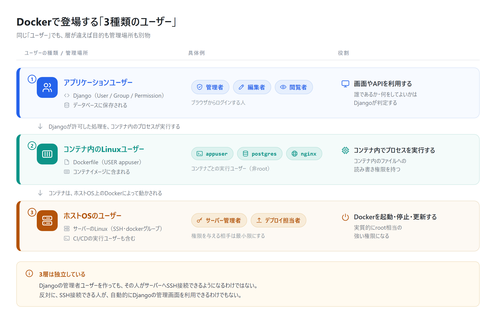
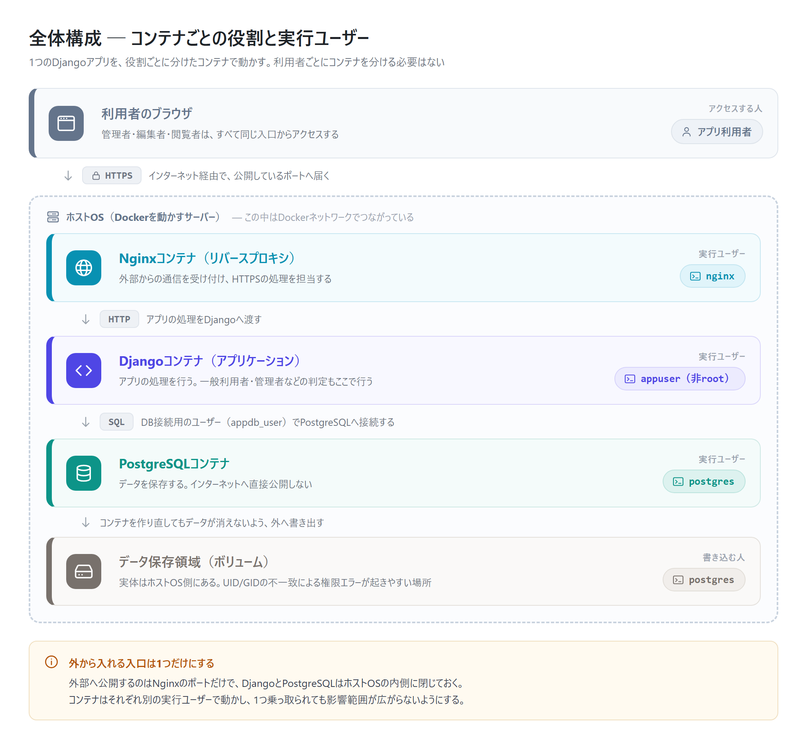

# 01. 基本概念とユーザーの3層

## この章の目的

Dockerを使った構成に登場する3種類のユーザーを区別できるようにします。あわせて、利用者がログインしてデータを見るまでに、どの層が何を判定しているのかを追います。

## 現在地

```text
【01. 基本概念】 → 02. コンテナ実行 → 03. データ・権限 → 04. 運用・デプロイ
```

---

## 1. 最初に理解するべき「3種類のユーザー」

Dockerを使う構成では、少なくとも次の3種類のユーザーが登場します。

| 種類 | 具体例 | 役割 | 主な管理場所 |
| --- | --- | --- | --- |
| アプリケーションユーザー | 管理者、編集者、閲覧者 | 画面やAPIを利用する | Django・データベース |
| コンテナ内のLinuxユーザー | `appuser`、`postgres` | コンテナ内でプロセスを実行する | Dockerfile・コンテナイメージ |
| ホストOSのユーザー | サーバー管理者、デプロイ担当者 | Dockerを起動・停止・更新する | サーバーのLinux |



同じ「ユーザー」でも、それぞれ目的が異なります。

たとえば、Django上の管理者ユーザーを作っても、その人がサーバーへSSH接続できるようになるわけではありません。反対に、サーバーへSSH接続できる人が、自動的にDjangoの管理画面を利用できるわけでもありません。

```text
アプリを利用する人
    ↓ HTTP/HTTPS
Djangoの認証・認可
    ↓
Djangoプロセスを実行するappuser
    ↓
Dockerを動かしているホストOS
```

この3層を混ぜないことが、権限設計の出発点になります。

---

## 2. 全体構成

想定する構成は次のとおりです。



コンテナごとに役割と実行ユーザーを分けます。

- Nginxは外部からの通信を受け付ける
- Djangoはアプリケーションの処理を行う
- PostgreSQLはデータを保存する
- 一般利用者・管理者などの判定はDjangoが行う

利用者ごとにDjangoコンテナを分ける必要はありません。

> この図は完成形の構成です。
> [02. コンテナの実行ユーザーと安全性](02_container_execution_and_security.md)のDocker Compose例は、非root化の説明に集中するためNginxを省き、DjangoとPostgreSQLだけの最小構成にしています。本番ではこの図のようにNginxを前段へ置き、Djangoのポートは外部へ公開しません。

---

## 3. アプリ利用時の流れ

ここでは、一般利用者がブラウザからアプリへログインし、データを閲覧する流れを追います。

### Step 1: 利用者がアプリへアクセスする

```text
利用者
  ↓
https://example.com/login
```

ブラウザから送られたリクエストは、最初にNginxなどのリバースプロキシへ届きます。

### Step 2: NginxがDjangoへ転送する

```text
ブラウザ
  ↓ HTTPS
Nginx
  ↓ HTTP
Django
```

Nginxは通信の受付やHTTPSの処理を担当し、アプリの処理をDjangoへ渡します。

### Step 3: Djangoがログイン情報を確認する

Djangoは、送信されたメールアドレスやパスワードなどを確認します。

```text
Django
  ↓ ユーザーを検索
PostgreSQL
  ↓ 検索結果
Django
```

パスワードは平文で比較するのではなく、保存済みのハッシュ値を使って検証します。

### Step 4: Djangoが利用者の権限を確認する

認証に成功したら、Djangoは「誰であるか」だけでなく、「何をしてよいか」も確認します。

| ロール | 閲覧 | 登録 | 更新 | 削除 | 管理画面 |
| --- | ---: | ---: | ---: | ---: | ---: |
| 管理者 | 可 | 可 | 可 | 可 | 可 |
| 編集者 | 可 | 可 | 可 | 不可 | 不可 |
| 閲覧者 | 可 | 不可 | 不可 | 不可 | 不可 |

Djangoでは、主に次の機能でこれを表現します。

| 機能 | 表すもの |
| --- | --- |
| `User` | アプリ利用者の情報 |
| `Group` | 管理者、編集者、閲覧者などのグループ |
| `Permission` | 閲覧、登録、更新、削除などの許可 |
| `is_staff` | Django管理画面へのアクセス可否 |
| `is_superuser` | すべての権限を持つか |

### Step 5: 許可された処理だけを実行する

```text
閲覧者が一覧を開く
  ↓
Djangoが閲覧権限を確認
  ↓ 許可
PostgreSQLからデータを取得
  ↓
画面に一覧を表示
```

一方、閲覧者が削除APIを直接呼び出した場合も、Django側で拒否します。

```text
閲覧者が削除APIを呼ぶ
  ↓
Djangoが削除権限を確認
  ↓ 拒否
403 Forbidden
```

画面上の削除ボタンを隠すだけでは不十分です。必ずサーバー側でも権限を確認します。

ここまでが「アプリケーションユーザー」の層の話です。次章では、このDjango自体がコンテナ内のどのLinuxユーザーで動いているのかを見ます。

---

**次に読む**: [02. コンテナの実行ユーザーと安全性](02_container_execution_and_security.md)

**関連**: DjangoがPostgreSQLへ接続するときのDBユーザーについては [03. DBと永続データの権限設計](03_data_and_permission_design.md) で扱います。
